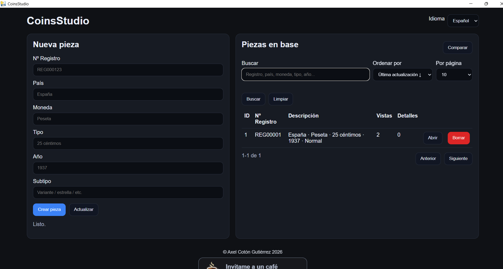
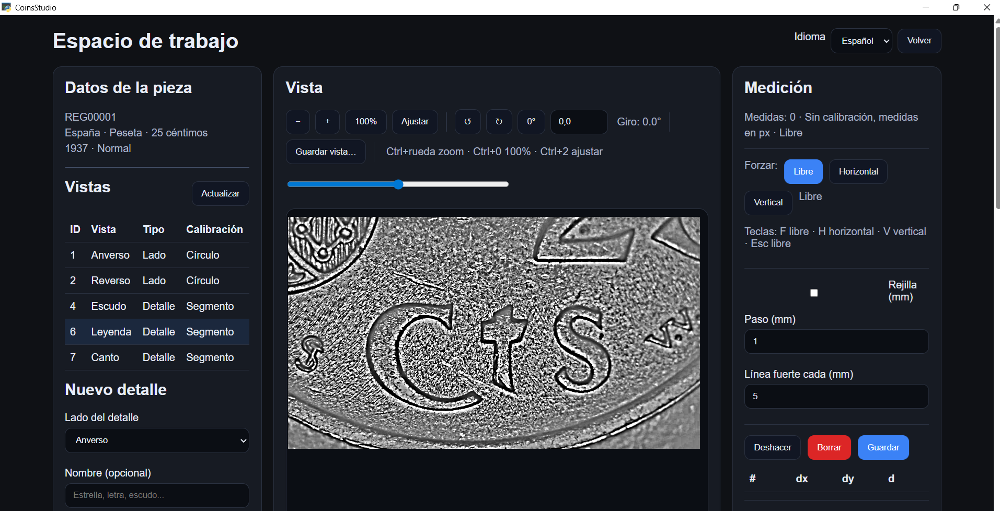
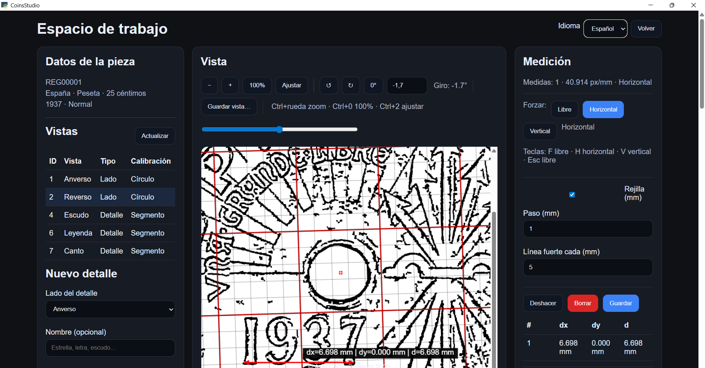
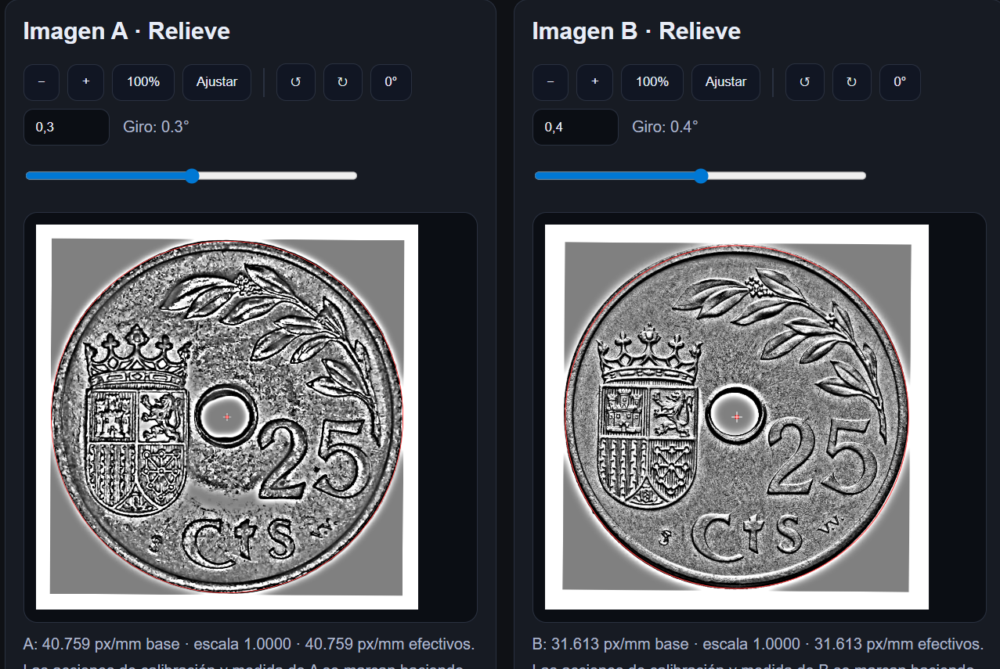
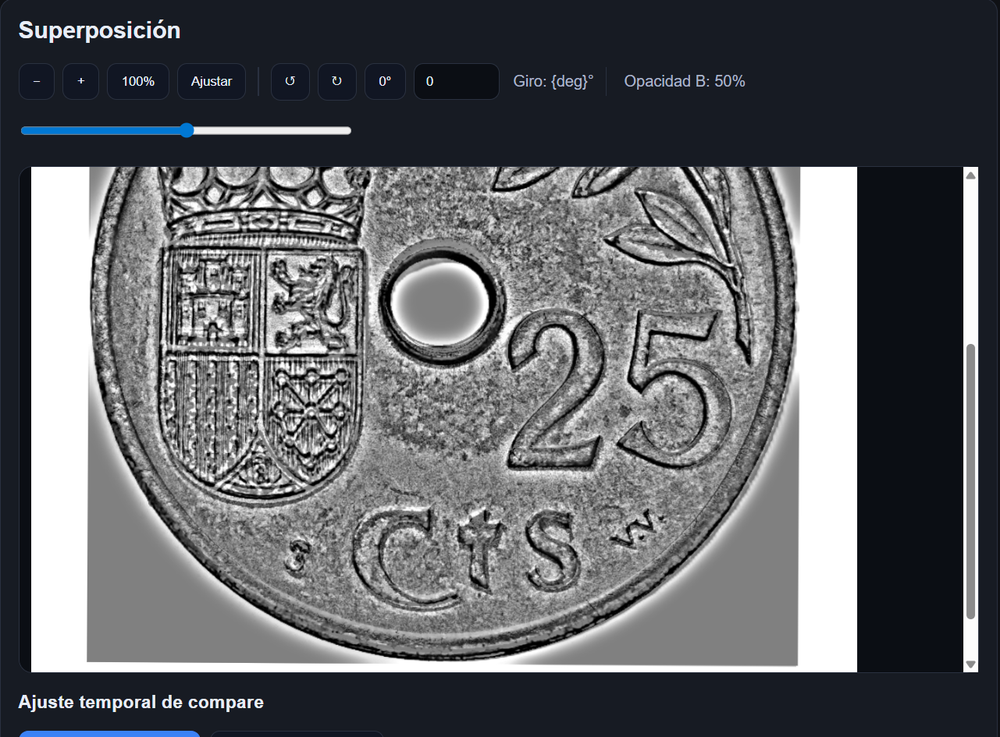
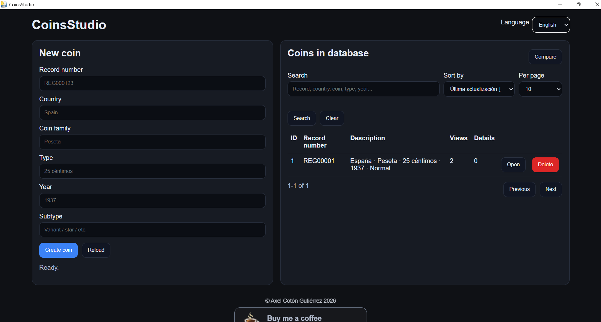
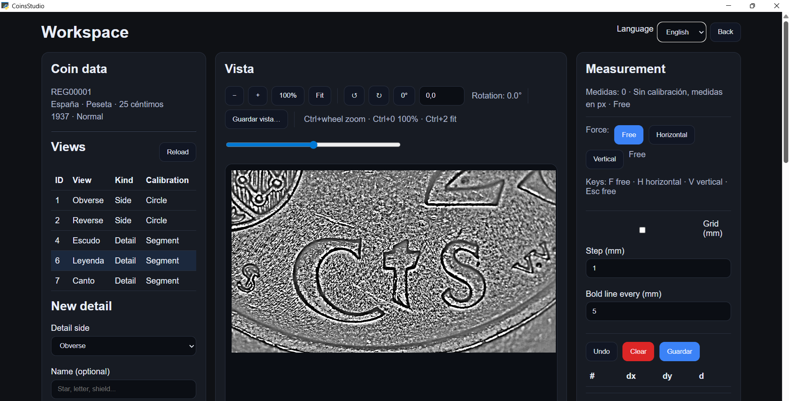
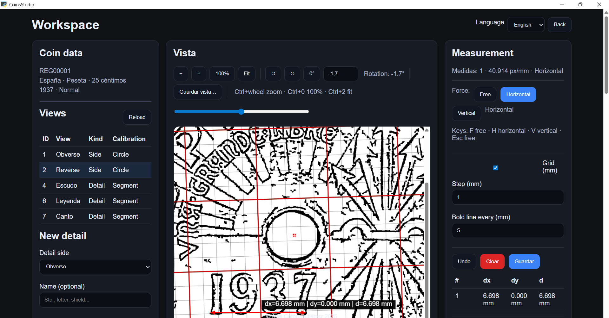
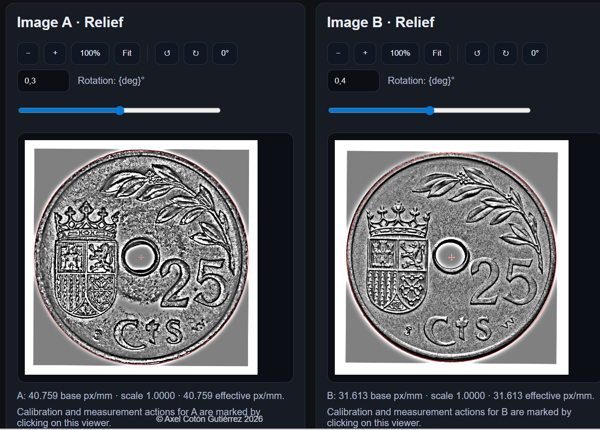
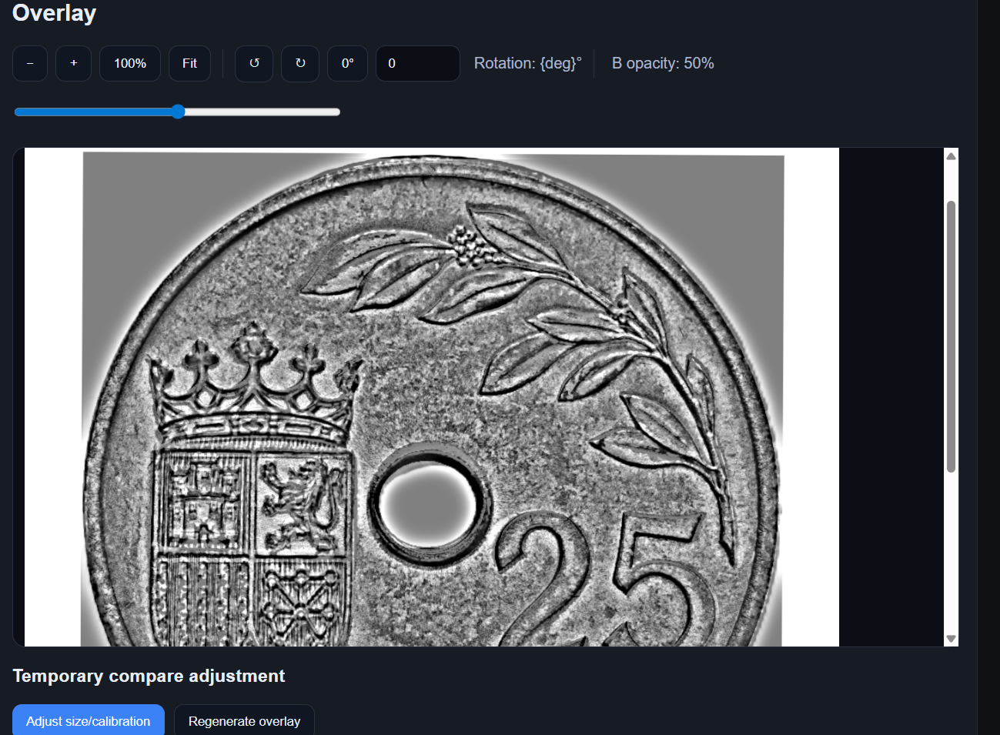

# CoinsStudio

## Español

CoinsStudio es una aplicación de escritorio para organizar, visualizar, procesar, calibrar, medir y comparar imágenes de monedas.

### Estado del proyecto

Versión pública actual: **1.3.0**

El proyecto continúa en desarrollo y puede recibir mejoras, ajustes y nuevas funciones en futuras versiones.

### Descarga

[La descarga del instalador está disponible en la sección **Releases** de este repositorio.](https://github.com/AxelCotonGutierrez/CoinsStudio-public/releases/latest)

### Instalación

1. Descarga la versión más reciente desde **Releases**.
2. Ejecuta el instalador `CoinsStudio_Setup_x.x.x.exe`.
3. Sigue los pasos del asistente de instalación.
4. Abre CoinsStudio desde el acceso directo o desde el menú Inicio.

### Aviso de seguridad de Windows

Al tratarse de una aplicación no firmada digitalmente, es posible que Windows Defender, SmartScreen o algunos antivirus muestren una advertencia al descargar o ejecutar el instalador.

Esto ocurre porque la aplicación no dispone de un certificado comercial de firma de código. Se recomienda descargar siempre CoinsStudio únicamente desde la fuente oficial del proyecto.

### Funciones principales

- Gestión de piezas
- Gestión de vistas
- Procesados de imagen
- Calibración
- Medición
- Comparación de imágenes
- Exportación de resultados

### Capturas

#### Pantalla inicial

#### Espacio de trabajo

#### Medición

#### Comparación

#### Superposición

### Vídeos de uso

Los vídeos de uso se publican en YouTube.

- Audio: español
- Subtítulos: inglés

Aquí se enlazarán los tutoriales disponibles:

- Descarga: [Ver en YouTube](https://www.youtube.com/watch?v=l0fCW0Sol9M)
- Instalación en Windows: [Ver en YouTube](https://www.youtube.com/watch?v=2OJKYMa1d1I)
- Primera Pieza: [Watch on YouTube](https://www.youtube.com/watch?v=GMWzIoOJRwc)
- Gestión de piezas
- Procesados
- Calibración
- Medición
- Comparación

### Historial de cambios

Consulta el archivo [CHANGELOG.md](CHANGELOG.md).

---

## English

CoinsStudio is a desktop application designed to organize, display, process, calibrate, measure, and compare coin images.

### Project status

Current public version: **1.3.0**

The project is still under active development and may receive improvements, adjustments, and new features in future versions.

### Download

[The installer is available in the **Releases** section of this repository.](https://github.com/AxelCotonGutierrez/CoinsStudio-public/releases/latest)

### Installation

1. Download the latest version from **Releases**.
2. Run the installer `CoinsStudio_Setup_x.x.x.exe`.
3. Follow the setup wizard steps.
4. Open CoinsStudio from the desktop shortcut or from the Start menu.

### Windows security notice

Since this application is not digitally signed, Windows Defender, SmartScreen, or some antivirus programs may show a warning when downloading or running the installer.

This happens because the application does not include a commercial code-signing certificate. It is recommended to download CoinsStudio only from the official project source.

### Main features

- Piece management
- View management
- Image processing
- Calibration
- Measurement
- Image comparison
- Result export

### Screenshots

#### Main screen

#### Workspace

#### Measurement

#### Comparison

#### Overlay

### Video tutorials

Video tutorials are published on YouTube.

- Audio: Spanish
- Subtitles: English

The available tutorials will be linked here:

- Download: [Ver en YouTube](https://www.youtube.com/watch?v=l0fCW0Sol9M)
- Windows installation: [Watch on YouTube](https://www.youtube.com/watch?v=2OJKYMa1d1I)
- First piece: [Watch on YouTube](https://www.youtube.com/watch?v=GMWzIoOJRwc)
- First steps
- Piece management
- Processing modes
- Calibration
- Measurement
- Comparison

### Change log

See [CHANGELOG.md](CHANGELOG.md).

---

## Autor / Author

**Axel Cotón Gutiérrez**

## Licencia / License

Pendiente de definir / To be defined.